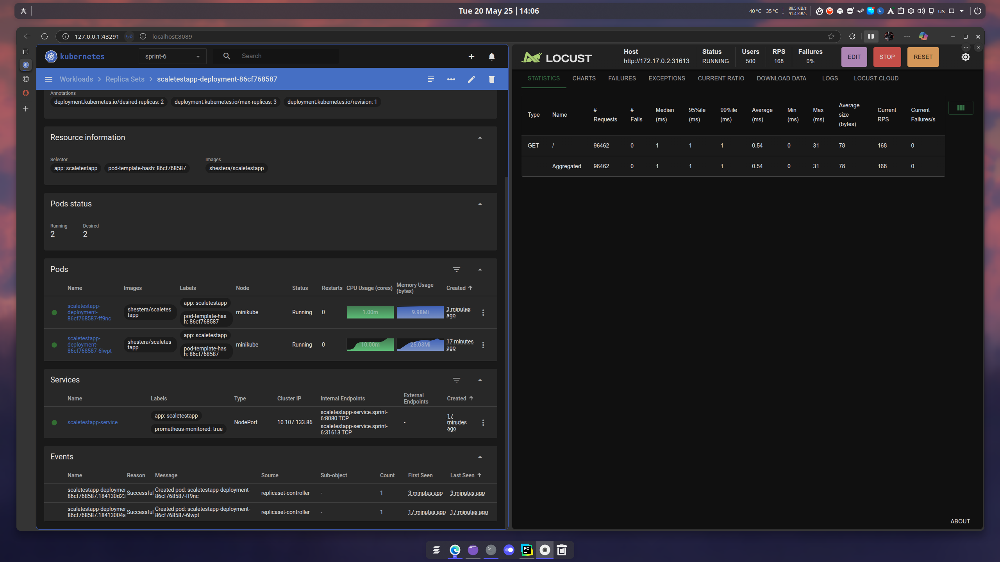
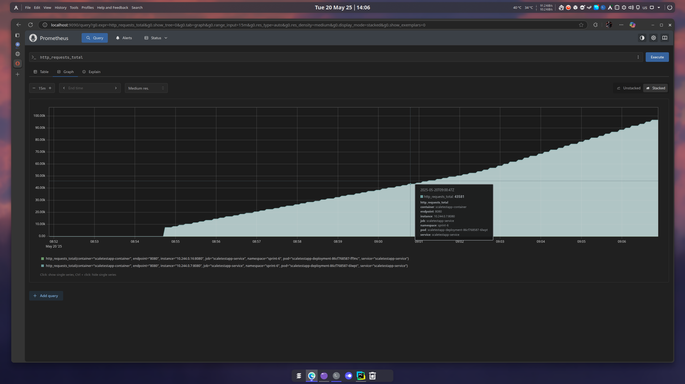
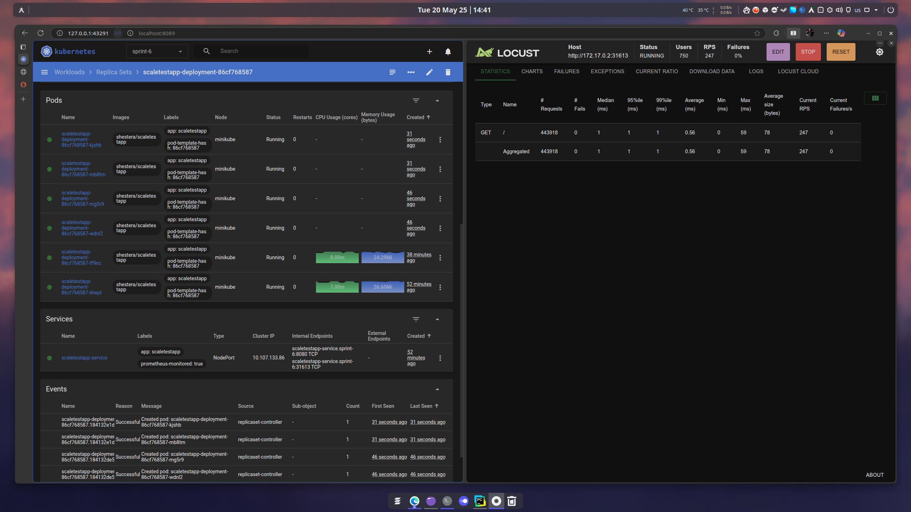

# Задание 2. Динамическое масштабирование контейнеров

Выполнены обе части задания.

Чтобы завелись конфиги, необходимо создать пространство имен `sprint-6` (в дефолтном метрики не собирались, хз почему так):
```bash
kubectl create namespace sprint-6
```
Собственно, при применении конфигов нужно докидывать `-n sprint-6` к командам.


Скейлинг по раме прописан в [hpa.yml](./hpa.yml),
по метрике с Prometheus в [hpa-custom.yml](./hpa-custom.yml).

### Результаты настройки кластера:

[**Масштабирование по порогу RAM:**](./1-ram-scaling.png)



[**Сбор метрик прометеем:**](./2-prometheus-metrics.png)



[**Масштабирование по числу обрабатываемых подом реквестов:**](3-http-request-count-scaling.png)



