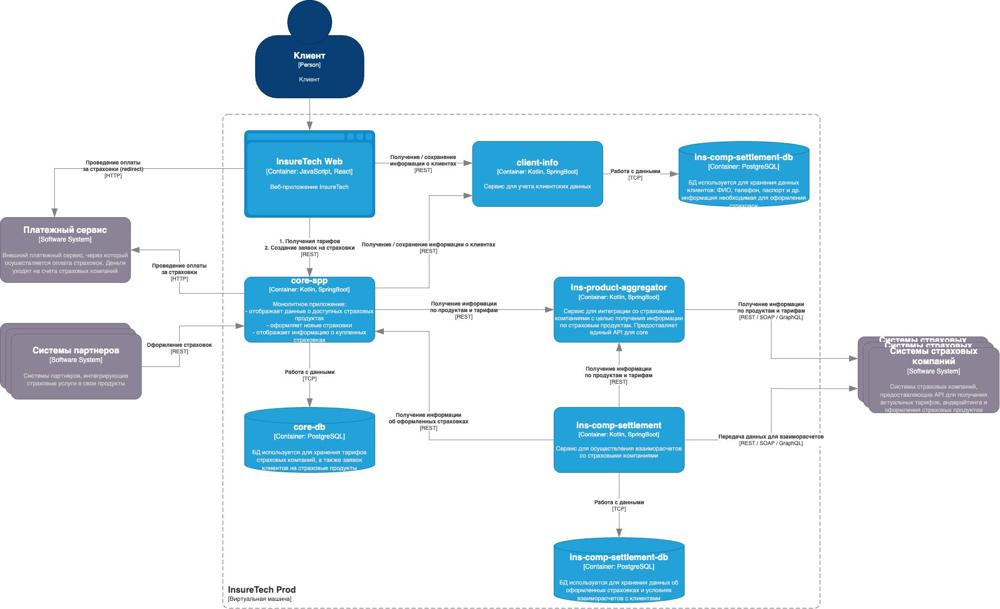
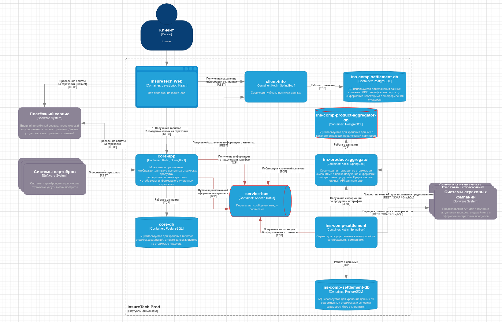

# Задание 3. Переход на Event-Driven архитектуру

Текущая архитектура выглядит следующим образом:

### В чем проблемы

В этом решении в глаза бросаются сразу несколько проблем:

- **Цепочка асинхронных вызовов при запросе партнерских предложений.** Монолит маркетплейса четырежды в час запрашивает 
обновление списка доступных предложений. В синхронном режиме - и сервис поставщик опять-таки синхронно 
опрашивает все подключенные компании. Это долго (минимум время на ответ
от самого медленного партнера + пересылка внутри кластера) и дорого (мы обновляем *весь* список страховых предложений).
А еще мы должны под каждого партнера писать свой костыль по сбору данных.

- **Несогласованность данных**. Если один из сервисов-потребителей отвалился во время обновления каталога, 
то он продолжит работать с устаревшей копией до следующего удачного апдейта.

- **Лаг между обновлением предложения у партнера и на портале.** Когда кто-то в партнерской организации изменяет или 
удаляет предлагаемую услугу, данное изменение на наш агрегатор попадет с лагом от 0 до 15 минут. 
И если за это время услугу кто-нибудь оформит, то будет очень грустно. Всем.

- **Ограничение горизонтального масштабирования.** Вообще это вытекает из п.1 - поскольку `core` и `settlement`
теребят каталог услуг напрямую через REST, это значит что нагрузку на последний по нескольким подам 
не размажешь. И что кронждобы на обновление будут приходить со всех экземпляров `core` и `settlement`, что положит
каталог уже просто окончательно.

- **Отвал выгрузки реестра оформленных страховок.** Если мы не смогли уведомить страховую о том, что что-то за нее продали, 
это прямо очень нехорошо.

### Как исправиться

Эти проблемы можно решить при помощи ивентинга, аутбокса и неболбших технических доработок:

[to-be diagram](./InsureTech_C4_сontainer-diagram.drawio)

- **Прикручиваем к `ins-product-aggregator` собственную БД**. Теперь вместо опроса сторонних систем 
(которые могут быть и недоступны) мы просто ходим к себе в базу.
- **Делаем публичный CRUD api на `ins-product-aggregator`.** Вместо полного обновления гетами по таймеру
даем каждому клиенту возможность самостоятельно управлять своими предложениями на площадке, 
тем самым не гоняя по сети весь каталог каждые 15 минут. Как приятный бонус, вместо отдельных хэндлеров 
под каждую партнерскую ИС у нас появляется унифицированный DAL. Впрочем, это шаг можно пропустить, если в качестве
источника предложений у партнера выступает тупо сайт, который приходиться скрэйпить - 
в таком случае просто переносим крон с монолита на сервис каталога, где вручную ищем дельту в данных и публикуем ее в кафку.
- **Ставим между `core-app`, `ins-product-aggregator` и `ins-comp-settlement` кафку и пишем в нее 
события об изменении предложений каталога и заявок.** Таким образом создание/изменение/удаление услуг и заявок будет 
писаться в шину (тут даже снапшоты на первых парах не понадобятся), откуда их можно будет
немедленно забрать, не дергая сервис синхронизации напрямую.
- **Оформление страховки и обновление предложения в каталоге оборачиваем в outbox.** Это критические для всей системы
куски и нам *необходимо* гарантировать доставку связанных с ними событий -
чтобы клиент оформил действительное предложение по актуальной цене, а партнер получил все оплаченные заказы.

Таким образом мы закрываем долгое и избыточное обновление каталога, лаг при его изменении, ограничения масштабирования,
проблемы с выгрузкой реестра заказов и бонусом получаем тайм-тревел по истории изменений каталога.

