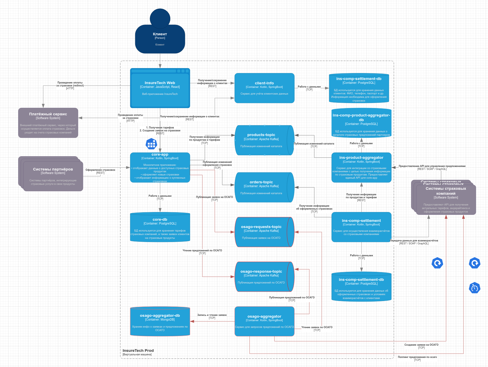

# Задание 4. Проектирование продажи ОСАГО

TLDR: нужно получить заявку от клиента с параметрами автомобиля/водителя, пробросить её в 10 партнерских API,
дождаться по каждой их них предложения и вернуть оное клиенту без ожидания остальных страховых.

[diagram file](./InsureTech_C4_сontainer-diagram.drawio)

### Описание решения

**1. Хранилище данных**

Новоявленному `osago-aggregator` потребуется свое хранилище данных - как минимум, чтобы не держать в памяти 
все заявки по которым мы ждем ответ и чтобы просто дернуть готовую из базы, если запрос отвалился. 

Вот с типом хранилища некоторый затык. Проще всего использовать `MongoDB` - запоминаем все предложения и ссылаемся
на персистентный документ при оформлении. Вот только минимум 90% таких документов будут лишним мусором в системе,
поэтому можно обсудить использование `Redis` в качестве временного хранилища с TTL на предложения, откуда
ненужное будет удаляться самостоятельно. К тому же, перманентно хранить предложения от страховых смысла нет - 
в любой момент тарифы могут измениться.

**2. API в `osago-aggregator`**

Отсутствует - используем асинхронное взаимодействие через кафку, чтобы не гробить масштабирование.

**3. Интеграция `core-app` и `osago-aggregator`**

Все общение между сервисами идет через джва топика кафки - `osago-request-topic` для запроса и
`osago-response-topic` для предложения.

**4. API в `core-app`**

_Этот пункт описан с точки зрения пользователя SignalR_

В приложение мы добавляем сокет-хаб с 2 публичными методами:

- `RequestOSAGO(UserData @params)` - инициализирует подачу заявки партнерам путем пересылки сообщения в 
сервис-агрегатор;
- `ForwardResponeToClient(ResponseData result)` - пересылает на клиент полученное из кафки предложение 
по ОСАГО от одного конкретного партнера.

**5. Font-to-back**

Для общения с `core-app` используем вебсокеты - тут иначе никак, разве что слать 10 отдельных запросов с указанием
в какую страховую его перенаправить. Используем вышеупомянутый `SignalR` или что там в жаве.

**6. Паттерны отказоустойчивости**

Используются следующие фичи:

- Rate limiting для апи `core-app` - в нашем случае это единственный публичный API, лимитка тут так-и-так нужна.
- Retry для создания заявки на ОСАГО в стороннем API и для поллинга её статуса - 
кратковременный отвал партнерского сервиса не должен привести к преждевременному завершению запроса.
- TimeOut для поллинга статуса заявки в сторонней системе - у нас 60 секунд на все про все, не успели ответить - 
пишем в кафку пустоту.

**7. Думаем про многоподовость**

Тут вроде все хорошо - нет синхронного взаимодействия между внутренними компонентами системы, можем 
горизонтально скейлиться пока есть мощности.

